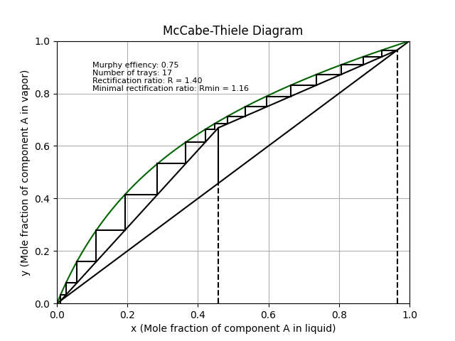

# McCabe-Thiele Diagram Generator

This Python script generates a **McCabe-Thiele diagram** for binary distillation processes. It calculates and visualizes the equilibrium curve, operating lines (rectifying and stripping sections), q-line, and steps off the theoretical trays required for separation. The diagram is useful for understanding and designing distillation columns.



---

## Table of Contents
- [Description](#description)
- [Features](#features)
- [Installation](#installation)
- [Usage](#usage)
- [Parameters](#parameters)
- [Example](#example)

---

## Description
The McCabe-Thiele method is a graphical technique used to determine the number of theoretical stages required for the separation of a binary mixture in a distillation column. This script automates the process by:
1. Plotting the equilibrium curve using Murphy efficiency.
2. Drawing the operating lines for the rectifying and stripping sections.
3. Plotting the q-line (feed line).
4. Stepping off the theoretical trays.
5. Displaying key information such as the number of trays, reflux ratio, and Murphy efficiency.

---

## Features
- **Equilibrium Curve**: Calculated using Murphy efficiency for non-ideal behavior.
- **Operating Lines**: Rectifying and stripping sections are plotted based on the reflux ratio and feed condition.
- **Q-line**: Represents the thermal condition of the feed.
- **Theoretical Trays**: Automatically calculates and steps off the number of trays required for separation.
- **Customizable Parameters**: Adjust feed composition, distillate composition, reflux ratio, and more.

---

## Installation
1. Clone the repository:
   ```bash
   git clone https://github.com/versbyte/McCabe-Thiele-method
   cd your-repo

2. Install the required dependencies:
    ```bash
    pip install numpy matplotlib scipy

## Usage

1. Import this script into your Python environment.
2. Define the input parameters (e.g., feed composition, distillate composition, reflux ratio, etc.).
3. Call the McabeThiele function to generate the diagram.

---

```python
from main import McabeThiele

# Define parameters
xf = 0.458  # Feed composition
xd = 0.965  # Distillate composition
xb = 0.011  # Bottoms composition
R = 1.4     # Reflux ratio
q = 1       # Feed thermal condition
Pa = 95     # Saturation vapor pressure of component A (mmHg)
Pb = 23.76  # Saturation vapor pressure of component B (mmHg)
nm = 0.75   # Murphy efficiency

# Generate McCabe-Thiele diagram
McabeThiele(xf, xd, xb, R, q, Pa, Pb, nm)